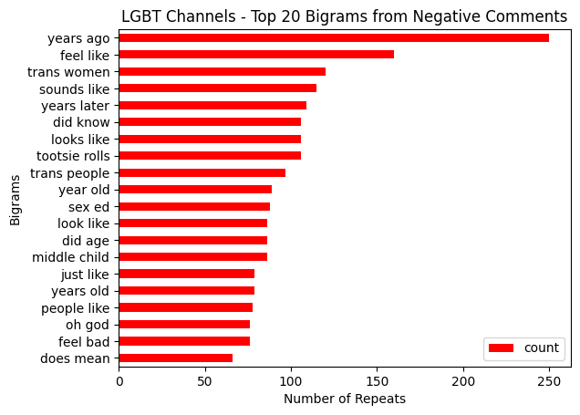
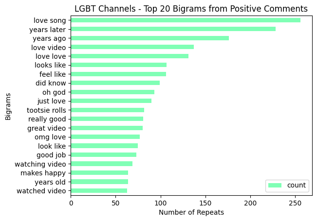
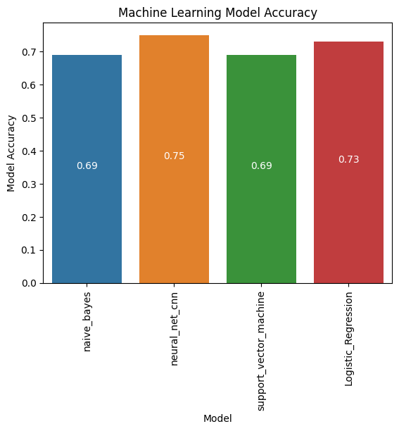

# Machine Learning-Based Sentiment Analysis of YouTube Comments

## Authors
Jenna Barkley, Ryan Beebe, Hany Dief, Katie Djahan, Jesús Jiménez, Jed Miller, Vinny Shankar
## Note
This is the best damn team to ever do a group project. :tada:
## Dependencies
- The dashboard requires a Python environment (version 3.7 and above)
- The following packages are required to populate the database and launch the HTML dashboard
    - `pip install flask`
    - `pip install pymongo`
    - `pip install bson`
    - `pip install pandas`
## Database Setup
- This project requires a MongoDB database, command line tools, and the MongoDB Compass App.
- Install pymongo to the development environment by activating the environment and running the command `pip install pymongo` in a terminal.
- MongoDB Installation instructions:
    - For MacOS, please refer to [the official MacOS documentation](https://www.mongodb.com/docs/manual/tutorial/install-mongodb-on-os-x/)
    - For Windows PC, please refer to [the offical Windows PC documentation](https://www.mongodb.com/docs/manual/tutorial/install-mongodb-on-windows/)
- Mongosh Installation instructions:
    - For Mac: Run the following commands in a terminal:
        - `brew tap mongodb/brew`
        - `brew update`
        - `brew install mongodb-community@6.0`
        - `brew services start mongodb-community@6.0`
    - For Windows PC, please refer to [the offical Windows PC documentation](https://www.mongodb.com/docs/mongodb-shell/install/)
- MongoDB Compass Installtion instructions: [Here](https://www.mongodb.com/try/download/compass)
- Once MongoDB, the command line tools, and Compass are installed:
    - Launch the MongoDB Compass App and connect to localhost.
    - Run the `database.py` file in the Dashboard folder using the command `python database.py`
## How to deploy the Dashboard
- Connect to the local MongoDB database
- Open a terminal
- Activate the environment in which all the dependencies are installed
- Run the `app.py` file in the Dashboard folder using the command `python app.py`
## Activity Summary
1. Created a list of YouTube videos in a CSV file
2. Harvested comments for the videos through the YouTube API (Sample Notebook of API Fetch: [Link](Archive/vinny/large_channels_data_fetch.ipynb))
3. Created and optimized a machine learning model to drop spam and process the comments (Notebook Link: [Link](Machine_Learning/data_stretch_drop_spam.ipynb))
4. Used the [roberta pre-trained model](https://huggingface.co/roberta-base) to label each comment as neutral (0), negative (1), or positive (2) (Notebook Link: [Link](Machine_Learning/big_comments_roberta.ipynb))
5. Saved the cleaned and labeled comments in a JSON file
6. The file was over 100MB in size, so the team took a random sample of 45% of data and saved it in a separate JSON
7. Populated a local MongoDB database with the 45% file (Python Script Link: [Link](Dashboard/database.py))
8. Used the cleaned and labeled comments to create and optimize four additional supervised learning models [Source](https://medium.com/@jays34955/finding-and-optimizing-a-good-text-classification-model-aea96d93d2fc) (Notebook Link: [Link](Machine_Learning/post_label_optimization.ipynb))
9. Built a dashboard with a Python Flask API backend and JavaScript/HTML/CSS frontend
10. Used the MongoDB database to populate the dashboard visualizations
11. Built a second dashboard using Tableau (Tableau Public Link: [Link](https://public.tableau.com/app/profile/hany.dief/viz/SentimentTableau_16925687052100/BonusTableauVisualizationStory))
## Sample Visuals

- This is an example of one of the wordclouds generated during this project. This wordcloud shows the most commonly used words in our entire database. (N-gram and Wordcloud coding help from Clément Delteil). Link to notebook: [Link](Dashboard/Img/wcloud.ipynb)  

- This plot shows the 20 most common bigrams found in comments that were:
    - From channels that publically identify themselves as LGBT
    - And our pre-trained RoBERTa model identified as "negative"
    - Link to notebook: [Link](Dashboard/Img/bigrams.ipynb)  

- This plot shows the 20 most common bigrams found in comments that were:
    - From channels that publically identify themselves as LGBT
    - And our pre-trained RoBERTa model identified as "positive"  

- Machine Learning Model Accuracy for each of the four models used during the post-RoBERTa-label optimization
    - Link to notebook: [Link](Machine_Learning/post_label_optimization.ipynb)  
## Code References
Webb, G.I. (2011). Naïve Bayes. In: Sammut, C., Webb, G.I. (eds) Encyclopedia of Machine Learning. Springer, Boston, MA. https://doi.org/10.1007/978-0-387-30164-8_576  
Bird, Steven, Edward Loper and Ewan Klein (2009), Natural Language Processing with Python (NLTK). O’Reilly Media Inc.  
Cortes, C. & Vapnik, V., 1995. Support-vector networks. Machine learning, 20(3), pp.273–297.
